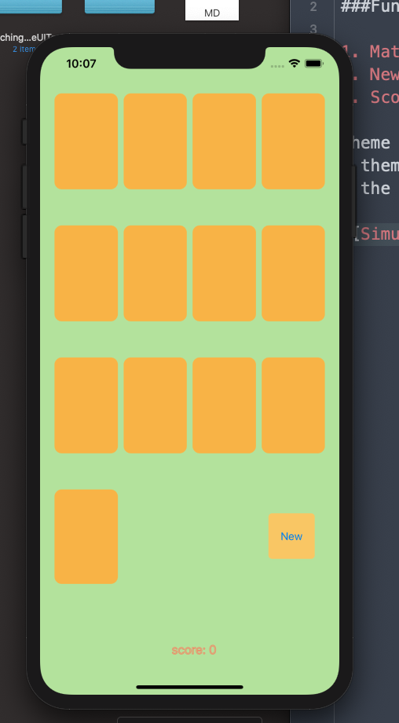

## the changes that were made and how it would look like:
### Functions:

1. Match some cards  
2. New Game (would change theme)  
3. Score (2pts per match)  

theme content:  
- theme color (button color, background color)  
- the emoji theme  

